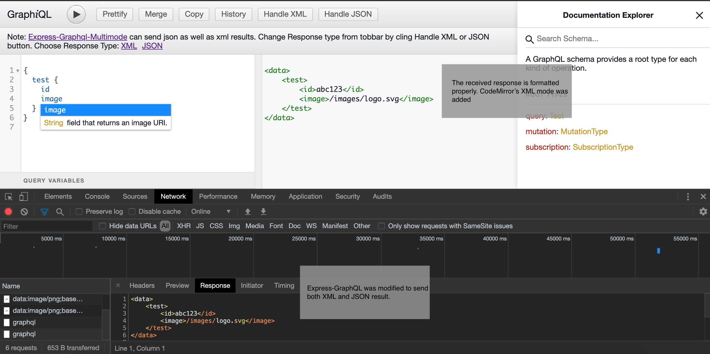
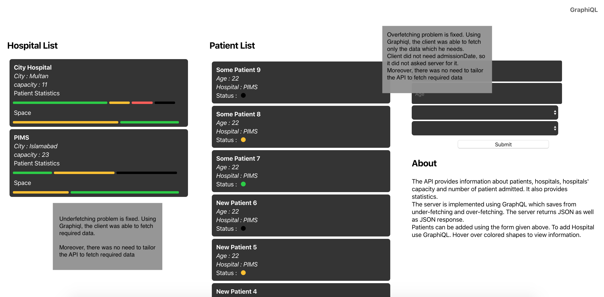

## About Me

I am a senior Engineering student at Pakistan Institute of Engineering and Applied Sciences, Islamabad.

### Personal Details
- **Legal Name** : Ali Nauroze
- **Email** : alinauroze@hotmail.com
- **Github** : [alinauroz](https://github.com/alinauroz)
- **Slack, Discord** : nauroz

### Tools

- **Programming Languages**: Javascript, Typescript, NodeJS, Deno
- **Libraries**: React, Redux
- **Cloud** : AWS, Heroku, Google Cloud

_I have experience of many other programming langauges such as C++, Java, PHP. But to be concise I am only mentioining things that are related to this project._

### Projects Completed

- **Odd Jobs**: An android app that connects workers with consumers in realtime. Frontend was in Java and backend was in NodeJS.
- **Messenger**: Built a messenger using NodeJS. PostreSQL and MongoDB were used to save data. 
- **2D Mapping using LIDAR** : A lidar and microcontroller programmed in C++ was used to detect distance and the data was sent to a PC using serialport. A Webpage then draws a 2D map of that space. I wrote mapping library myself. Frontend was in Vanilla Javascript.
- **Event Websites** : Developed event websites for university. More than 2000 users have registered using these websites.

### Opensource Projects
- Math Trade with Trade Maximizer, currently implemented using Couchbase. This ensures maximum possible trades between people. Both API and a simple frontend is available on github.
- Hardware Security Module, this project's main purpose is to write encryption and hashing algorithms that can run on small microcontrollers
- [Feat: Added XML support to Graphiql](https://github.com/graphql/graphiql/pull/1430)

### Adding Support from XML, YAML, MDX, TOML, ProtoBuf to GraphiQL

This package, lets name it _GraphiQLHuc (Huc is latin word, meaning anywhere)_, will allow developers to check XML, YAML, MDX, TOML, ProtoBuf as well as JSON results with GraphiQL.

**My plan to accompalish this Task**

First, I will start with adding XML support to new GraphiQL which will have Monaco Editor. Currently, there is a fetcher query in _GraphiQl.tsx_, that fecthes data and checks whether it is a valid JSON or not. If response is XML with some other format, it makes the response red which indicates that there is some error. So far, I have done some changes it to make it generic. Once XML support is added, it will be very easy to add YAML, TOML and MDX support.

Monaco Editor does not have syntax highlighting for ProtoBuf by default. So, I have to add Syntax Highlighting for ProtoBuf to Monaco Editor. Once it is added, it will become

### Test Project

This project is a prrof that i have knowledge of GraphQL. I have created both server and client. They are deployed on AWS. This is a basic app. API provides information of patients, hospitals and statistics. New patients and hospitals can be added using mutations. GraphQL is used to avoid under-fetching and over-fetching. Links are given here.

- [AWS : GraphQL Hospital Server](http://52.66.182.42:3003) 
- [AWS : GraphQL Hospital Client](http://52.66.182.42:3001)
- [AWS: GraphiQL](http://52.66.182.42:3003/graphiql)
- [Github: API Source](https://github.com/alinauroz/graphql-hospital)

Here is a snapshop of the client.

